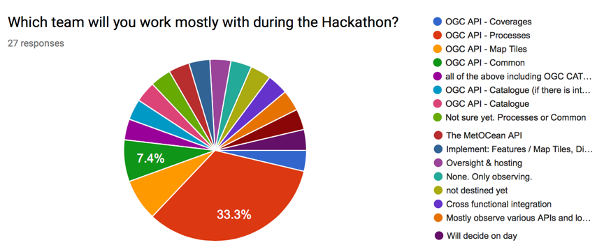
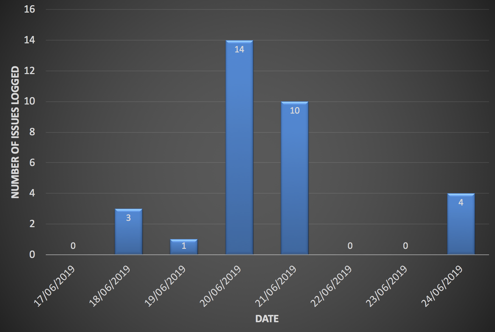
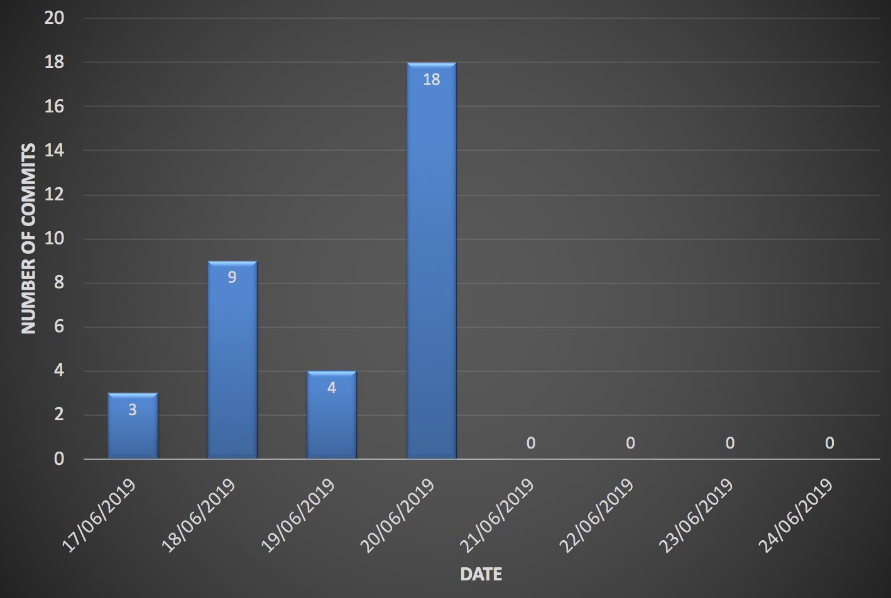

[[KeyFindings]]
== Key Findings

This section presents the key findings from the Hackathon.

=== What occurred

==== Processes

The decision to hold the OGC API Hackathon was made by the TC at the 2019 TC meeting in Singapore. Following this decision, OGC staff engaged a number of potential sponsors from the OGC membership. Having identified sponsors and hosts, a series of teleconferences were held for planning the event. These teleconferences discussed venue logistics, computing infrastructure, data, scenarios, catering and other topics. A Gantt chart of the planning and execution of the hackathon is shown in <<img_gantt>>.

[#img_gantt,reftext='{figure-caption} {counter:figure-num}']
.A Gantt chart of the planning and execution of the hackathon
image::images/gantt.png[width=800,align="center"]

During the hackathon, the process involved alternation between briefings, discussions and coding. On the first day of the hackathon, three back-briefs were held, that is one in the morning, another in the afternoon and another in the evening. These briefings provided an opportunity for issues to be discussed across teams. Agreements and resolutions from the discussions triggered by the briefings were then fed back into the team-specific work.

==== Organization

By the event date, 76 individuals had been registered to participate in-person and 35 participants had been registered to participate remotely. A questionnaire sent out just before the hackathon to collect information about which OGC API specifications the participants would focus on received 27 responses. The spread of responses to the hackathon is shown in <<img_interests>>.

[#img_interests,reftext='{figure-caption} {counter:figure-num}']
.Participants' interests

The hackathon was therefore organized around teams based on the OGC API specifications. Participants interested in APIs other than those for coverages, processes, and map tiles, were asked to contribute to the work on advancing the OGC API - Common specification. This would help ensure that the OGC API - Common specification provides an appropriate a base for all future OGC APIs.

==== Technology

The client and service applications were bound together through interfaces conforming to the OGC APIs for Map Tiles, Processes, Features, Catalogues, and Coverages. The client applications included software from Hexagon, Helyx, OpenSphere, Esri, Solenix, EURAC and Sinergise. The service applications included software from  52 North, CubeWerx, Esri, Helyx, pygeoapi, Geoserver, Spacebel, West University of Timisoara, and rasdaman. The variety of software implementations suggests that the OGC API specifications widely implementable and do not depend on any single vendor’s technology.

As discussed in <<Architecture>>, the software products that were deployed by the aforementioned organizations included:

* pygeoapi
* 52°North JavaPS
* Esri prototype facade on to ArcGIS Online tiled services
* rasdaman
* OpenSphere OGC API Plugin
* Hexagon LuciadLightspeed
* Solenix WPS Demo Client
* Esri OGC API-Tiles Demo Client

The deployed technologies includes software implemented in Python, Java, and NodeJS. Some of the deployed technologies include Python adapters to software implemented in C++. This variety of programming languages shows that the OGC API specifications are independent of any programming language.

==== Information

===== Communication

A key aspect of executing a hackathon is the communication within and between the participating teams. A number of communication tools were used within the OGC API Hackathon to facilitate communication.

* OGC Portal: Used for event planning.
* Gitter: Used for communication relating to technical information, due to its close integration with Github.
* Github: Used for logging issues and sharing documents (including the engineering report) across teams.
* OGC Mailing list: Used for sharing administrative information with all participants ahead of the hackathon.
* Gotomeeting: Used for the pre-event webinar and for teleconferencing with remote participants during the hackathon.

NOTE: The Ordnance Survey provided the Microsoft Teams platform for supporting participants that had requested access to the Ordnance Survey Cloud.

===== Knowledge Capture

The various teams involved in the hackathon used the Github repositories of their relevant OGC API specifications to log issues that were identified during discussions. Note that the hackathon took place at the end of the week, and thus some of the participants were only able to log issues at the beginning of the week after the hackathon. <<img_issues>> presents a graph of the total number of issues logged in Github repositories on the lead up to the hackathon event, during the event and the week after the event. The effect of the hackathon is clearly visible from the 'spike' in the number of issues logged during the two days of the hackathon event (i.e. June 20th & 21st).

[#img_issues,reftext='{figure-caption} {counter:figure-num}']
.The total number of issues logged in Github repositories for Processes, Map Tiles, Common and Coverages

Changes to the OGC API specifications were made on the lead up to the hackathon, and during the event. <<img_commits>> presents the total number of commits in Github repositories for OGC APIs on the lead up to the hackathon event, during the event and the week after the event. The commits represent more than 4600 additions and 3200 deletions to the draft API specifications.

[#img_commits,reftext='{figure-caption} {counter:figure-num}']
.The total number of commits made to Github repositories for Processes, Map Tiles, Common and Coverages

It should be noted that although the hackathon resulted in additions and deletions to the draft API specifications, the outputs of the hackathon are subject to vetting and approval processes of the relevant OGC Standards Working Groups. Therefore there is always the possibility that the Standards Working Groups may reject all of the outputs of the hackathon. To an extent, such an outcome is mitigated by the participation of several members of the Standards Working Group in the hackathon. Further, appointing the editors of the OGC API specifications as the Team Leads of the hackathon appeared to improve the likelihood of acceptance of changes made during the hackathon.

=== Experiences

TBA

=== Lessons learnt

TBA

=== What are the next steps?

TBA
