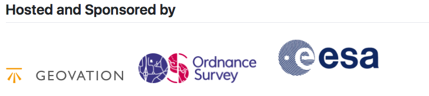

[appendix]
[[OGCAPIHackathonAgenda]]
= Invitation to Participate

=== Invitation Announcement

The Open Geospatial Consortium (OGC) is organizing a Hackathon to develop OGC Application Programming Interface (API) specifications and invites you to participate.

The motivation for these OGC APIs is discussed on the OGC Blog at http://www.opengeospatial.org/blog/2996

This hackathon will test draft OpenAPI-based standards for coverages, map tiles, processes using a common template based on the OGC API for features, aka WFS3 [1].

The event will be instrumental to the evolution of the OWS standards to a modern API based approach, setting the course for open geospatial standards for the next decade. The hackathon will be organized around:

Coverages
Map Tiles
Processing
Use of the OGC API for features, aka WFS3, is anticipated during many of the hackathon activities.

The outputs of the hackathon will inform the development of the OGC API - Common standard [2], the OGC API - Features standard [3], OGC API – Processes s standard [4], the OGC API – Coverages standard [5] and the OGC API – Map Tiles standard [6].

An OGC Hackathon is a collaborative and inclusive event driven by innovative and rapid programming with minimum process and organization constraints to support the development of new applications and open standards.

The scope of the event is proposed to include service development and testing, using one or more implementations of OpenAPI/Swagger [7]. Participants are welcome to bring partial or complete implementations of servers or clients to support the Hackathon.

A repository for collaborative work across the OGC API teams has been set up [8].

The Hackathon will begin on June 20th, 2019 at 09:00am, and end on June 21st, 2019 at 05:00pm. It will be hosted by Ordnance Survey at the Geovation Hub (https://geovation.uk/) in London. The physical address of the Geovation Hub is:

Sutton Yard, 4th Floor

65 Goswell road

London

EC1V 7EN

There will be opportunity for joint discussion with all participants on the goals and objectives of the event, as well as final briefing of findings and opinions of the participants. However, the majority of the time will be spent in collaboration between participants in active coding.

The Hackathon will be run by Standards Working Group (SWG) Chairs, with support from OGC staff.

Attendance priority will be given to those with an implementation or desire to implement the specifications.

Register by 1st May 2019 at https://ogc-api-hack2019.eventbrite.com

If you require funding to support your travel to the hackathon, please also complete the form (by May 1st, 2019) at https://docs.google.com/forms/d/1c0Zxy1d-9PvuRnfN2R-iIeP3Rcgbc9PMw1UfdN6Kw-A

Logistics information can be found at https://portal.opengeospatial.org/files/?artifact_id=83748

Remote Participation information can be found at https://portal.opengeospatial.org/files/?artifact_id=83864

The agenda for the event can be found at https://portal.opengeospatial.org/files/?artifact_id=83865

We're looking forward to seeing you at the Hackathon.

Appendix B - References:

1. WFS3 draft specification, https://cdn.rawgit.com/opengeospatial/WFS_FES/3.0.0-draft.1/docs/17-069.html

2. OGC API Common specification Github repository, https://github.com/opengeospatial/oapi_common

3. WFS3 Github repository, https://github.com/opengeospatial/WFS_FES

4. WPS Rest Binding Github repository, https://github.com/opengeospatial/wps-rest-binding

5. OGC API – Coverages Github repository, https://github.com/opengeospatial/ogc_api_coverages

6. OGC API – Map Tiles Github repository, https://github.com/opengeospatial/OGC-API-Map-Tiles

7. OpenAPI Specification 3.0.1, https://github.com/OAI/OpenAPI-Specification/blob/master/versions/3.0.1.md

8. OGC API Hackathon 2019 Cross Team Github repository, https://github.com/opengeospatial/OGC-API-Hackathon-2019
