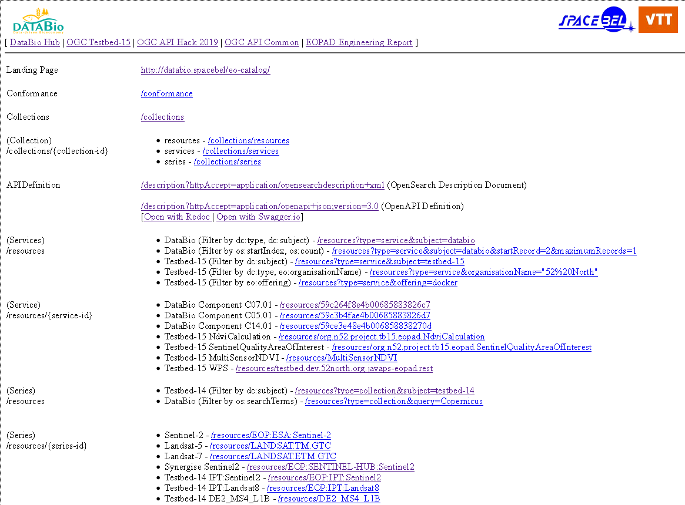
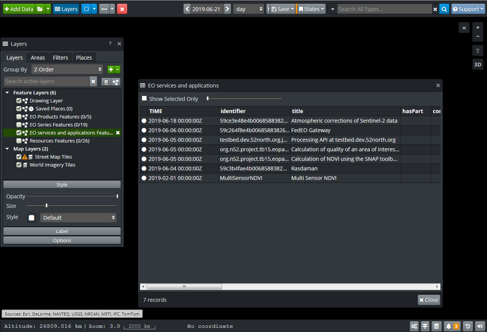
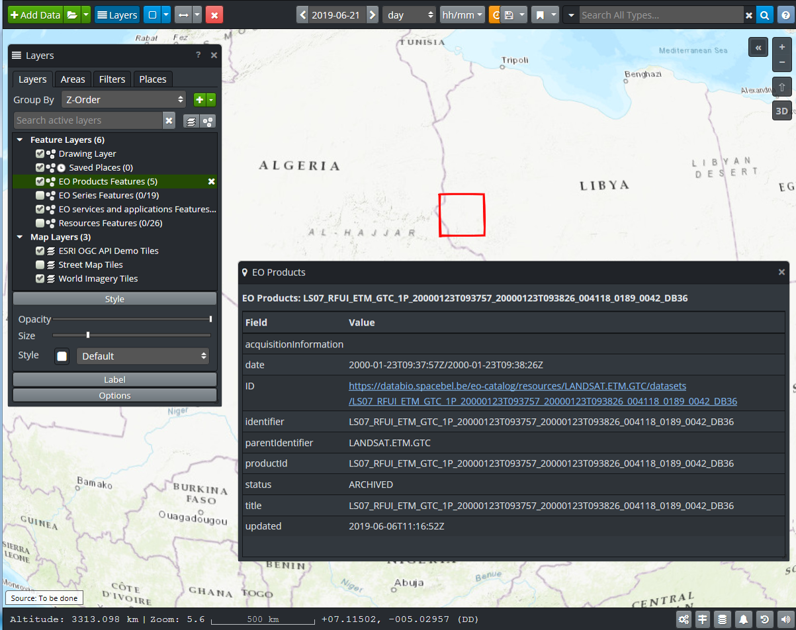

[[Spacebel]]
=== Spacebel

==== Motivation to Participate

Spacebel participated remotely on behalf of the https://www.databio.eu/en/[H2020 DataBio project] contributing a Catalog Server implementation hosting application and dataset metadata from the DataBio Hub (https://www.databiohub.eu/registry/) aiming to improve alignment of the DataBio catalog and Hub implementation with the OGC API Common specification in addition to the Testbed-15 EOPAD discovery approach.

[#img_object_openapi,reftext='{figure-caption} {counter:figure-num}']
.DataBio Catalog Server test page

In addition, Spacebel was also present in London to participate with ESA support to the OGC API Processes activities contributing an OGC API Processes implementation (Proxy).

==== Implemented Solution

DataBio Catalog Server (https://databio.spacebel.be/eo-catalog/readme.html) hosting EO applications and services (OGC 19-020), EO collections (OGC 17-084) and EO product (OGC 17-003) metadata implementing OpenSearch (OGC 10-032r8 and OGC 13-026r8) and Open API Common interfaces.  Resources `/`, `/conformance`, `/collections` were implemented and interoperability was demonstrated through TIE testing with the http://frozen-lime.surge.sh/[OpenSphere client] implementing OGC API Features provided by another participant. A `limit`
parameter needed to be added server-side in addition to the `maximumRecords` parameter (which was used to comply with OASIS searchRetrieve (SRU) specifications) which was originally mapped on `{count}`.

==== Proposed Alternatives

The Catalog Server combines an OpenSearch interface with GeoJSON responses (OGC 13-026r8, OGC 17-047) for simple clients and a more advanced OpenAPI-based interface.

==== Experiences with OGC API Specifications

Spacebel has experience with Swagger and OpenAPI since 2016 and already used this in previous OGC Testbeds.  Wrapping an OpenSearch compliant catalog with an OGC API Common interface was achieved as part of the hackaton.  Extending the interface to OGC API Features (mainly temporal and geograpical searches) is future work.

The following screenshots show that service and application data and EO product metadata could be sucessfully discovered via the OpenSphere client accessing the DataBio Catalog Server.

[#img_object_openapi,reftext='{figure-caption} {counter:figure-num}']
.EO Service and Application metadata (OGC 19-020) from DataBio and OGC Testbed-15 shown in OpenSphere

[#img_object_openapi,reftext='{figure-caption} {counter:figure-num}']
.EO Product metadata (OGC 17-003) shown in OpenSphere

==== Other Impressions & Recommendations

Further alignment of the OpenSearch Catalog Server with OGC API Features interfaces, requires reconciling the time and bbox related search parameters from OGC 10-032 and OGC API Features.  While OGC 10-032r8 has separate search parameters representing the start and end of a search interval `{time:start}` and `{time:end}` respectively, OGC API Features imposes a single search parameter to represent the interval.  

The approach to represent links in JSON is unfortunately different that the encoding proposed by OGC 14-055r2 which means that an OpenSearch implemention based simultaneously on OGC 14-055r2 and OGC 17-047 in combination with OGC API Common will have different encodings for links in search responses and in other resource representations (e.g. `/conformance`, `/` etc).

The OGC API specifications are imposing to advertise "paths" in the Landing Page response and also contain wording suggesting that actual path names such as "api", "conformance", "collections" are mandatory and not just examples.  This should be made clearer and it seems redundant to impose the declaration of paths in the landing page if indeed the path names are "fixed".

OpenSearch and OpenAPI Common convergence would benefit from a revision of OGC 10-032r8 to ensure that the geo:box, time:start and time:end can be combined in a single URL template with the actual parameter names imposed by OpenAPI Common for temporal and geographical search.
